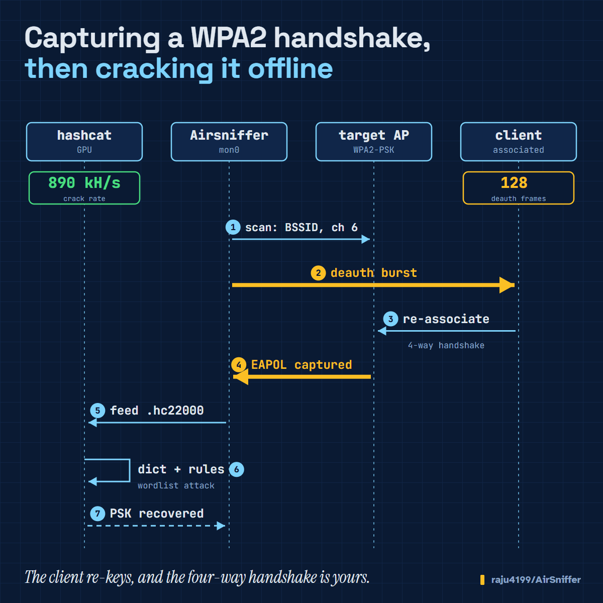
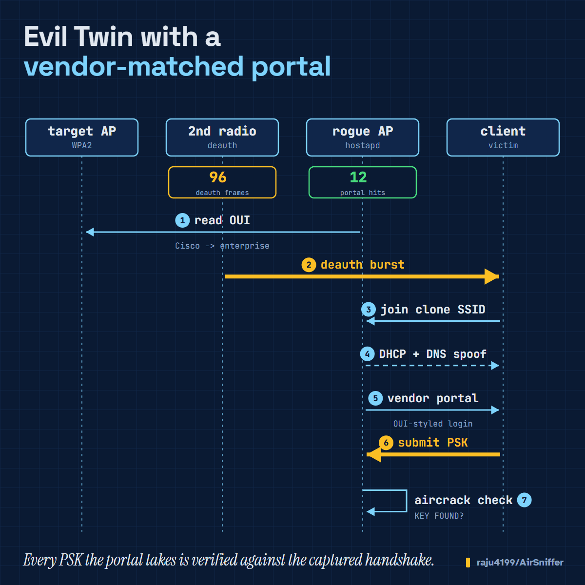

<!-- ╔══════════════════════════════════════════════════════════════╗ -->
<!--                        A I R S N I F F E R                       -->
<!-- ╚══════════════════════════════════════════════════════════════╝ -->

<div align="center">


<h1></h1>


<br><br>

[![Version-shield]](CHANGELOG.md)
[![Bash-shield]](http://tldp.org/LDP/abs/html/bashver4.html#AEN21220)
[![License-shield]](LICENSE)
[![Platform-shield]](#-what-youll-need)
[![Auth-shield]](#-authorized-use-only--read-this-first)

</div>

---

<div align="center">

### ⚠️ AUTHORIZED USE ONLY — READ THIS FIRST

</div>

> **Airsniffer is a weapon-grade auditing tool. Point it only at networks you own or have _explicit, written_ permission to test.**
>
> Sniffing traffic, capturing credentials, standing up a rogue AP, or knocking devices offline on networks you don't control is a **crime** in most of the world. There's no "I was just learning" exception in a courtroom. If you don't have a signed scope, a lab you built yourself, or a CTF range — **stop here.**
>
> You are 100% responsible for what you do with this. The authors accept **zero liability** for misuse or damage. Full terms live in the [Legal](#-legal--the-fine-print-that-matters) section — and they're not optional reading.

Who this is *for*: 🛡️ pentesters & red teams · 🎓 students & researchers · 🚩 CTF players · 🏠 people hardening their own gear.

---

## 🎬 See it move

**The classic WPA2 kill-chain — deauth a client, grab the 4-way handshake, crack it offline:**

<div align="center">



</div>

**Evil Twin, but smarter — fingerprint the AP by its OUI, serve a portal that looks like the client's *own* gateway, herd them over with a dedicated deauth radio, and verify every submitted password against the real handshake:**

<div align="center">



</div>

---

## 🧭 What is this thing?

Wi-Fi auditing is a mess of a dozen CLI tools, each with its own flags, its own quirks, and its own way of leaving your adapter in a broken state. **Airsniffer wraps the whole workflow in one menu-driven console** so you spend your time thinking about the target, not remembering whether it's `-c` or `--channel` this time.

Under the hood it's pure **Bash** — no heavy runtime, no framework — orchestrating the battle-tested tooling you already trust (`aircrack-ng`, `hashcat`, `hostapd`, `reaver`, and friends). It sets up monitor mode, scans, captures, cracks, and runs rogue-AP scenarios, checking for the stuff that usually bites you *before* it bites you.

<div align="center">

```
   ┌──────────┐   ┌──────────┐   ┌──────────┐   ┌──────────┐   ┌──────────┐
   │  SETUP   │──▶│ DISCOVER │──▶│ CAPTURE  │──▶│  ATTACK  │──▶│  REPORT  │
   │ monitor  │   │ scan &   │   │ hshake / │   │ crack /  │   │ trophies │
   │  mode    │   │ recon    │   │ PMKID    │   │ eviltwin │   │ & logs   │
   └──────────┘   └──────────┘   └──────────┘   └──────────┘   └──────────┘
```

</div>

---

## 🧪 What can you actually test?

Everything below runs from the interactive menu with guided prompts. Think of it as your engagement checklist.

| 🎯 Area | What you can do | Backed by |
|---|---|---|
| **Recon** | Scan 2.4 / 5 / 6 GHz, list APs & clients, decloak hidden ESSIDs, read PMF/MFP status | `airodump-ng` |
| **WEP** | Full all-in-one WEP flow (the museum piece, still fun in a lab) | `aircrack-ng` suite |
| **WPA / WPA2** | Capture the 4-way **handshake**, grab **PMKID** (clientless), then crack **offline** | `aircrack-ng`, `hashcat`, `john` |
| **WPA3-SAE** | Dedicated WPA3 menu, MFP/PMF analysis, plus research-grade plugins (fuzzing, protocol attacks) | plugins + externals |
| **WPS** | **Pixie-Dust**, online PIN bruteforce, null-PIN, and a bundled **known-PIN database** | `reaver`, `bully` |
| **Evil Twin** | Rogue AP with **vendor-aware captive portal**, live PSK verification, dual-radio deauth pursuit | `hostapd`, `dnsmasq`, `lighttpd` |
| **Enterprise** | Evil Twin against WPA-Enterprise, credential/certificate capture | `hostapd-wpe`-style flow |
| **DoS (resilience testing)** | Deauth, Auth DoS, beacon flood, WDS confusion — for *controlled* stress tests | `mdk4` / `aireplay-ng` |
| **Offline cracking** | Dictionary, bruteforce, rule-based; GPU acceleration | `hashcat`, `aircrack-ng` |

> 💡 Airsniffer warns you when a target enforces **WPA3 / PMF (802.11w)** so you don't waste an hour deauthing clients that will simply ignore you.

---

## ⚙️ How it works

No magic — just good plumbing. Here's the mental model:

1. **Environment check.** On launch it confirms root, Bash version, your distro, and which of the ~30 optional tools are actually installed — then tells you exactly what's missing and offers to help.
2. **Interface prep.** Pick an adapter; Airsniffer handles monitor mode, kills interfering processes when needed, and tags each card with its Wi-Fi standard and supported bands.
3. **Target selection.** Scan, then pick from a clean, sortable list (by signal, band, encryption, WPS state, …).
4. **Run the module.** Each attack/capture spins up its own worker windows (`xterm` or `tmux`), streams live status, and drops results — handshakes, PMKIDs, cracked keys, captured creds — into organized **trophy files**.
5. **Extend it.** The **plugin system** loads any `plugins/*.sh` at startup, so you can add or override behavior without ever touching the core script.

<details>
<summary><b>🔌 Plugins that ship in the box</b> (click to expand)</summary>

<br>

| Plugin | What it adds |
|---|---|
| `fuzzing_dos.sh` + `fuzzing_dos_engine.py` | WPAxFuzz-style 802.11 management/control/SAE fuzzer with a **safe simulation mode** (crafts & logs frames, transmits nothing) and a gated live mode |
| `modern_wifi_attacks.sh` | Managed launchers for research tools: SSID Confusion, KRACK, FragAttacks, MacStealer, Kr00k, SAE fuzzing |
| `missing_dependencies.sh` | Helps resolve absent tools |
| `plugin_template.sh` | Copy this to build your own — define your hooks, drop it in `plugins/`, done |

</details>

---

## 📦 How to install

### 🐧 Requirements — what you'll need

- **Linux** — Kali, Parrot, BlackArch, Arch, Debian/Ubuntu, and the rest all work
- **Bash 4.2+**
- **Root** (`sudo`) — non-negotiable for radio work
- A **wireless adapter with monitor mode** (and packet injection for the active stuff)
- Core tooling: the **`aircrack-ng`** suite, plus optional `hashcat`, `hostapd`, `dnsmasq`, `lighttpd`, `bettercap`, `reaver`/`bully`, `mdk4`, and more — *Airsniffer checks all of this for you on startup.*

### 🚀 Get it running

```bash
git clone https://github.com/raju4199/AirSniffer.git
cd AirSniffer
sudo bash airsniffer.sh
```

First launch runs the dependency check, offers to fix what's missing, and drops you straight into the main menu. That's it.

### 🐳 Prefer Docker?

```bash
docker build -t airsniffer .
docker run --rm -it --privileged --net=host airsniffer
```

### 🎛️ Tune it (optional)

Drop an [`.airsnifferrc`](.airsnifferrc) in place to preseed defaults — interface names, color/language prefs, 5/6 GHz toggles, `mdk3` vs `mdk4`, plugin system on/off, Evil Twin behavior, and more — so you skip the repetitive prompts.

---

## 🆚 What makes it different from airgeddon?

Airsniffer stands on airgeddon's shoulders (see the thanks below 🙏) and adds a batch of upgrades aimed squarely at **modern 2025+ networks**:

| Upgrade | Why you care |
|---|---|
| 🎭 **Vendor-aware Evil Twin portals** | The rogue AP reads the target's MAC OUI and serves a portal that *matches the client's real gateway* — enterprise, ISP, or consumer look, with the vendor's own brand colors and logo. Way more convincing than a generic page. |
| 📡 **Automatic dedicated deauth adapter** | Got a second card? Airsniffer auto-assigns it to the deauth and turns on pursuit mode — one radio holds the AP + portal rock-steady while the other chases the target across channels. |
| 🛡️ **WPA3 / PMF reality check** | Detects PMF-enforcing targets *before* you attack and warns that deauth will bounce off — then points you at the moves that actually work. No more false "it's secure" conclusions. |
| 🧬 **WPA3-SAE research plugins** | A growing WPA3 menu with a simulation-first fuzzing engine and managed launchers for the latest published protocol attacks. |
| 🎚️ **6 GHz + modern adapter awareness** | Band hopping in pursuit mode, Wi-Fi-standard detection, better distro detection, dynamic terminal sizing. |
| ✨ **Refreshed everything** | Animated intro, consistent branded headers, cleaner wording end to end. |

<div align="center">

### 🙏 Thanks to airgeddon

</div>

Let's be clear: **none of this exists without [airgeddon](https://github.com/v1s1t0r1sh3r3/airgeddon).** Airsniffer is a fork of that project, and its author and community built the foundation everything here rests on. Enormous respect and gratitude to them — and to the wider ecosystem (**Aircrack-ng**, **hashcat**, **hostapd**, **reaver**, and many more) whose tools do the real heavy lifting. Go star the originals. 💙

---

## ⚖️ Legal — the fine print that matters

> **Airsniffer is strictly for legal, authorized security testing and education.**
>
> Use it **only** on networks you own or have **explicit, written permission** to assess. Intercepting traffic, capturing credentials, or disrupting networks without authorization is **illegal** in most jurisdictions. You alone are responsible for your actions, and the authors and contributors accept **no liability** for misuse or any resulting damage.
>
> If you're unsure whether you're allowed to run a test — **you're not.** Get it in writing first.

---

## 📜 License & attribution

Airsniffer is **free software** under the **GNU General Public License v3.0 (or later)** — full text in [LICENSE](LICENSE).

```
Airsniffer — Copyright (C) 2026 Raju Ranjan
Based on airgeddon — Copyright (C) v1s1t0r
Licensed under GPL v3+ · SPDX-License-Identifier: GPL-3.0-or-later
```

**This is a fork of [airgeddon](https://github.com/v1s1t0r1sh3r3/airgeddon)** and, per the GPL's copyleft, stays GPL v3. The original airgeddon copyright and authorship are retained. Airsniffer is an independent derivative work — **not endorsed by or affiliated with** the airgeddon project.

<details>
<summary><b>📝 What changed from airgeddon</b> (GPL §5 change summary — click to expand)</summary>

<br>

- **Rebranded to Airsniffer** — script names, banners, intro animation, menu headers, on-screen wording, and the `.airsnifferrc` config.
- **Vendor-aware Evil Twin portals** — OUI fingerprinting → vendor-matched captive-portal templates (enterprise / ISP / consumer / modern).
- **Automatic dedicated deauth adapter** — second card auto-assigned to deauth with pursuit mode on, keeping the portal AP stable.
- **WPA3 / PMF (802.11w) effectiveness warning** before deauth-based attacks.
- **New plugins** — `fuzzing_dos.sh` (+ engine, simulation-first), `modern_wifi_attacks.sh` (managed launchers for published research tools).
- **Interface & QoL improvements** — see [CHANGELOG.md](CHANGELOG.md) for the version-by-version history.

</details>

**Third-party tools** (Aircrack-ng, hashcat, hostapd, dnsmasq, lighttpd, reaver, bully, mdk4, …) are orchestrated but **not bundled** — each ships under its own license by its own authors. Thanks to all of them. 💙

<div align="center">

<br>

**Built for defenders. Use responsibly. Break only what's yours.** 🛡️

<sub>Made with too much coffee and a healthy respect for the law.</sub>

</div>

<!-- ══════════════════════════ badge refs ══════════════════════════ -->
[Version-shield]: https://img.shields.io/badge/version-12.02-0093ee.svg?style=for-the-badge&colorA=273133 "Version"
[Bash-shield]: https://img.shields.io/badge/bash-4.2%2B-00db00.svg?style=for-the-badge&colorA=273133 "Bash 4.2 or later"
[License-shield]: https://img.shields.io/badge/license-GPL%20v3%2B-bd0000.svg?style=for-the-badge&colorA=273133 "GPL v3+"
[Platform-shield]: https://img.shields.io/badge/platform-Linux-1793d1.svg?style=for-the-badge&colorA=273133 "Linux"
[Auth-shield]: https://img.shields.io/badge/use-AUTHORIZED%20ONLY-orange.svg?style=for-the-badge&colorA=273133 "Authorized testing only"
